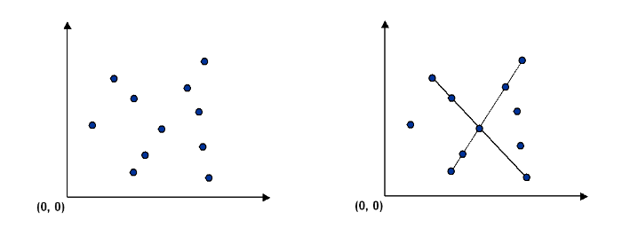
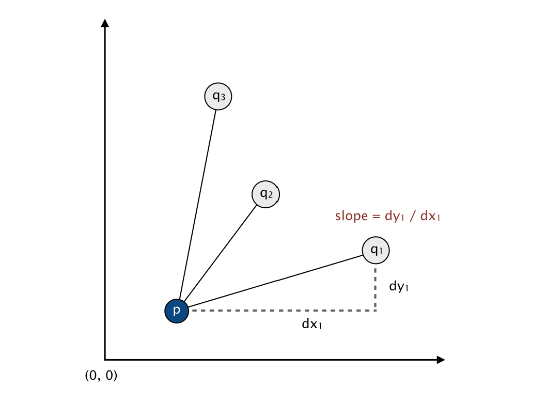
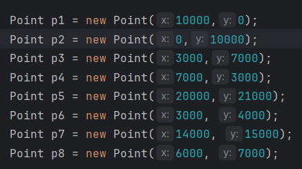

# Collinear Points

## The Problem

Given a set of n distinct points in the plane, finding every (maximal) line segment that connects a subset of 4 or more of the points.

 

## Brute-Force Way

Implementation of brute force way is easy. It examines 4 points at a time and checks whether they all lie on the same line segment, returning all such line segments. To check whether the 4 points p, q, r, and s are collinear, we check whether the three slopes between p and q, between p and r, and between p and s are all equal.

 

## A Faster, Sorting-Based Solution

Remarkably, it is possible to solve the problem much faster than the brute-force solution. Given a point p, the following method determines whether p participates in a set of 4 or more collinear points.

* Think of p as the origin.

* For each other point q, determine the slope it makes with p.
 
* Sort the points according to the slopes they makes with p.
 
* Check if any 3 (or more) adjacent points in the sorted order have equal slopes with respect to p. If so, these points, together with p, are collinear.

Applying this method for each of the n points in turn yields an efficient algorithm to the problem. The algorithm solves the problem because points that have equal slopes with respect to p are collinear, and sorting brings such points together. The algorithm is fast because the bottleneck operation is sorting.

 

## Result

The test class processes 8 points below and displays the result visually.

 

And here is the result;

 
 

MstfTurgut    
mstftrgt00@gmail.com
